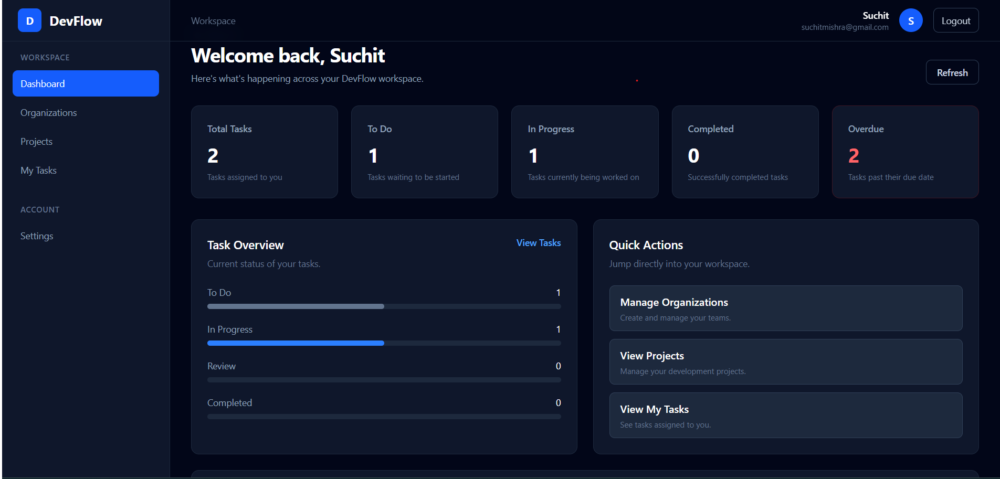
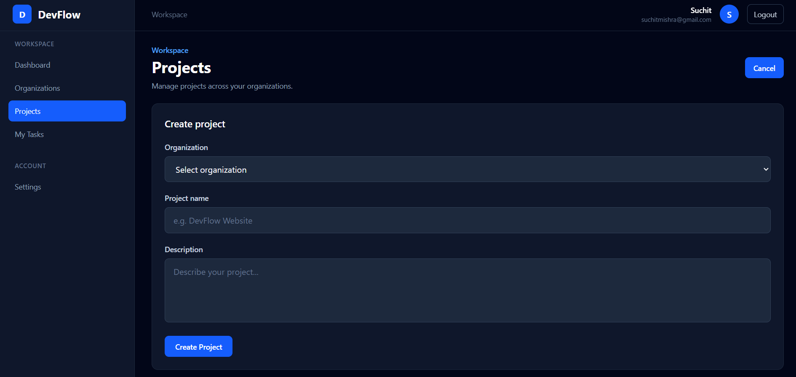
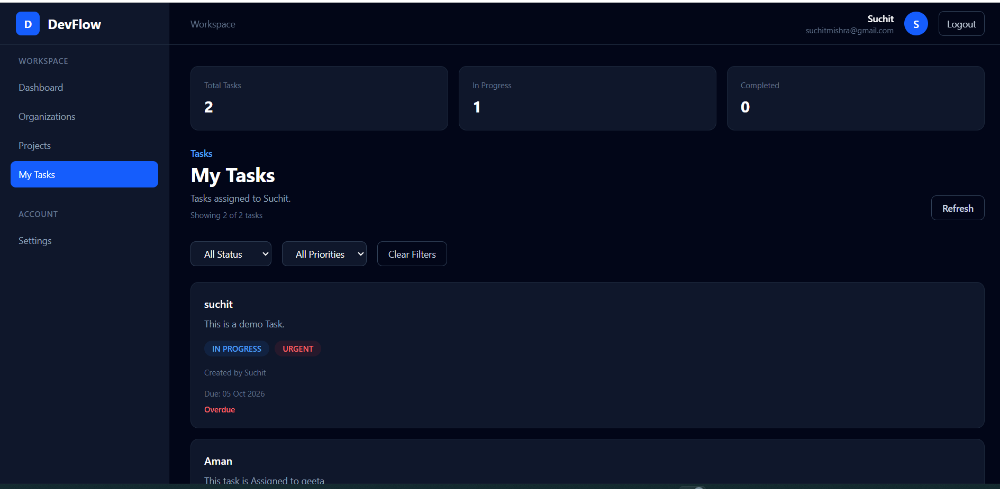
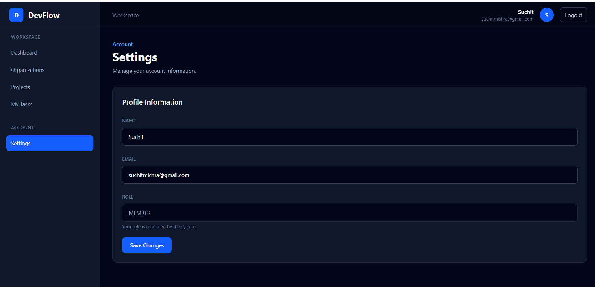

# DevFlow

A full-stack project and task management platform built with the MERN stack.

DevFlow helps teams organize work through organizations, projects, tasks, team members, task statuses, priorities, and activity tracking.

## Live Demo

**Frontend:** https://devflow-app-opal.vercel.app/

**Backend API:** https://devflow-backend-qof2.onrender.com/

## Features

- User registration and login
- JWT-based authentication
- Protected routes
- Organization management
- Project management
- Project member management
- Task creation and management
- Task assignment
- Task status management
- Task priority management
- My Tasks view
- Task statistics
- Task activity tracking
- Soft deletion and restoration of tasks
- Profile editing
- Responsive dashboard layout
- Production deployment

## Screenshots

### Dashboard



### Project Details



### Task Details



### Settings



## Tech Stack

### Frontend

- React
- Vite
- React Router
- Axios
- Tailwind CSS

### Backend

- Node.js
- Express.js
- MongoDB
- Mongoose
- JWT
- bcryptjs
- CORS
- dotenv

### Deployment

- Vercel — Frontend
- Render — Backend
- MongoDB Atlas — Database

## Architecture

```text
User
 │
 ▼
React + Vite Frontend
 │
 │ HTTPS / REST API
 ▼
Express.js Backend
 │
 ▼
MongoDB Atlas
```

## Project Structure

```text
devflow-app/
│
├── frontend/
│   ├── src/
│   │   ├── api/
│   │   ├── context/
│   │   ├── layouts/
│   │   ├── pages/
│   │   └── routes/
│   ├── package.json
│   └── vite.config.js
│
├── backend/
│   ├── config/
│   ├── controllers/
│   ├── middleware/
│   ├── models/
│   ├── routes/
│   ├── package.json
│   └── server.js
│
├── .gitignore
└── README.md
```

## Authentication

DevFlow uses JWT-based authentication.

Authentication flow:

```text
Register
   ↓
Password hashing with bcrypt
   ↓
Login
   ↓
JWT token
   ↓
Protected API requests
   ↓
Authenticated user
```

Sensitive environment variables are stored outside the Git repository.

## Getting Started

### 1. Clone the repository

```bash
git clone https://github.com/Suchit-Mishra-2050/devflow-app.git
cd devflow-app
```

### 2. Install frontend dependencies

```bash
cd frontend
npm install
```

Create a `.env` file:

```text
VITE_API_URL=http://localhost:4000
```

Start the frontend:

```bash
npm run dev
```

### 3. Install backend dependencies

Open another terminal:

```bash
cd backend
npm install
```

Create a `.env` file containing your local MongoDB connection string, JWT secret, and frontend URL.

Start the backend:

```bash
npm run dev
```

## Environment Variables

### Frontend

```text
VITE_API_URL=
```

### Backend

```text
PORT=
MONGODB_URI=
JWT_SECRET=
FRONTEND_URL=
```

Do not commit `.env` files or secret values to GitHub.

## Future Improvements

- Real-time collaboration
- Team invitations
- Role-based permissions
- File attachments
- Notifications
- Advanced analytics
- Search improvements
- Drag-and-drop task management
- Email notifications

## Author

**Suchit Mishra**

GitHub: https://github.com/Suchit-Mishra-2050
